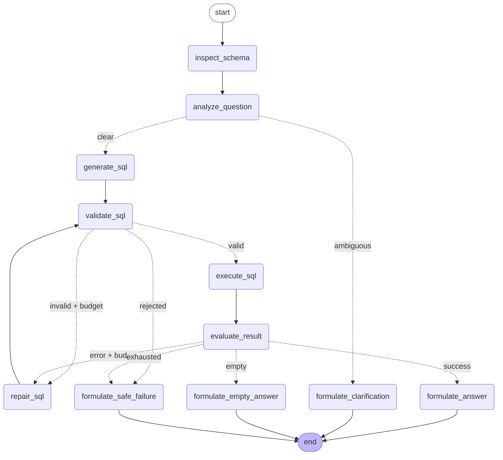
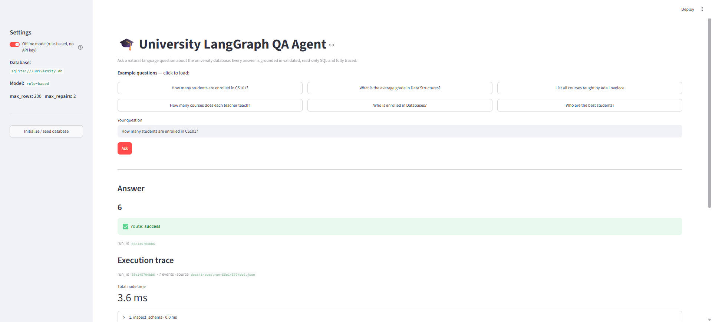
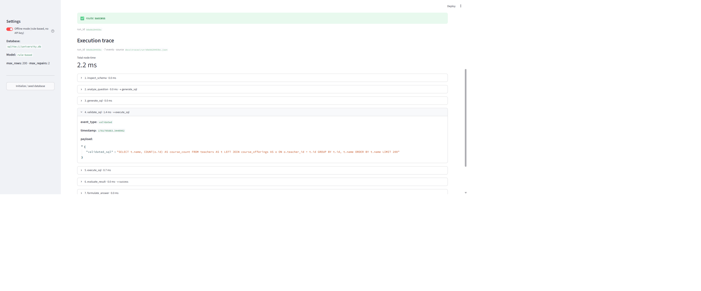

# University LangGraph QA Agent

A compact, **database-agnostic** natural-language question-answering system over
a university SQL database, implemented as an **explicit LangGraph state machine**
with deterministic safety controls around the LLM.

Ask questions like *"How many students are enrolled in CS101?"* or *"What is the
average GPA of students in courses taught by Ada Lovelace?"* and get grounded,
human-readable answers — with a full, inspectable execution trace for every run.

## Features

- Natural language → **structured SQL** → read-only execution → grounded answer
- Joins, filtering (by semester/course/teacher/student), counts, averages,
  grouping, subqueries/CTEs, and **multi-step** questions
- **Deterministic SQL safety**: single-statement, SELECT-only, auto-`LIMIT`,
  validated (sqlglot AST) and executed read-only
- **Bounded repair loop** for invalid/failed SQL — guaranteed to terminate
- Explicit handling of **ambiguity**, **empty results**, and **SQL errors**
- **Database- and LLM-agnostic core** (depends on protocols, not implementations)
- **Dual observability**: always-on portable JSON traces + optional LangSmith
- **No live LLM required for tests** — deterministic offline model included

## Graph



Dotted edges are conditional routes; `repair_sql` loops back to `validate_sql`,
bounded by `max_repairs`. Regenerate from the compiled graph with
`graph.get_graph().draw_mermaid()`.

## Requirements

- Python 3.11+
- An OpenAI API key *only* if you want to run against a live model. The demo,
  traces, and the entire test suite run fully offline.

## Setup (clean machine)

```bash
python -m venv .venv
# Windows:  .venv\Scripts\activate
# Unix:     source .venv/bin/activate

pip install -e ".[dev]"
cp .env.example .env        # optional; edit only if using a live LLM
```

## Usage

```bash
# 1. Create and seed the SQLite database
uni-agent init-db

# 2. Ask a question with the deterministic offline model (no API key)
uni-agent ask "How many students are enrolled in CS101?" --offline

# 3. Ask using a live OpenAI model (requires OPENAI_API_KEY in .env)
uni-agent ask "What is the average GPA of students in courses taught by Ada Lovelace?"

# 4. Run the full example catalog offline and write traces
uni-agent demo
```

Every run prints the answer plus `run_id`, the terminal `route`, and the path to
the JSON trace.

## Optional web UI

An optional Streamlit interface wraps the same agent core and renders the
per-node execution trace in the browser. It does not change the CLI or the
agent; offline mode is the default so no API key is required.

```bash
pip install -e ".[ui]"                 # installs streamlit
streamlit run ui/streamlit_app.py      # opens http://localhost:8501
```

If `streamlit` is not found (the virtualenv is not active on PATH), invoke it
through the interpreter instead — this always works:

```bash
# Windows
.venv\Scripts\python.exe -m streamlit run ui/streamlit_app.py
# Unix
.venv/bin/python -m streamlit run ui/streamlit_app.py
```

The UI shows the grounded answer, the terminal route, and an expandable
timeline of every graph node (timing, generated SQL, payloads) read from the
same `docs/traces/run-<id>.json` file the CLI writes. On first launch, use the
sidebar **Initialize / seed database** button if the database does not yet
exist; toggle **Offline mode** off to use a live OpenAI model.

**Overview** — question input, grounded answer, success route, and the start of the execution trace:



**Trace detail** — the per-node timeline with timing, routing, and the safety-validated SQL (note the injected `LIMIT`):



## Tests, lint, type-check

```bash
pytest --cov=uni_agent --cov-report=term-missing   # offline, no network
ruff check src tests
mypy src
python scripts/audit_deliverables.py               # deliverable + secret audit
```

## Tracing

Local JSON traces are always written to `docs/traces/run-<id>.json` and capture
run id, per-node timing, generated and validated SQL, row counts, routing
decisions, errors, and the final answer (secrets redacted). To also use
LangSmith, set `LANGCHAIN_TRACING_V2=true` and `LANGCHAIN_API_KEY` in `.env`.

## Documentation

- [`docs/architecture.md`](docs/architecture.md) — design, layers, graph diagram
- [`docs/examples.md`](docs/examples.md) — example questions, SQL, and outputs
- [`docs/production-considerations.md`](docs/production-considerations.md) — reliability, scale, monitoring, security, deployment
- `DECISIONS.md` — architecture decision records

## Project layout

```
src/uni_agent/
  config.py              # env-driven settings
  db/                    # schema.sql, seed.sql, adapter (protocol), introspection
  safety/                # deterministic SQL validator
  agent/                 # state, contracts, prompts, nodes, routing, graph, llm clients
  observability/         # portable JSON tracing + LangSmith toggle
  cli.py                 # init-db / ask / demo
tests/                   # database, safety, generation, routing, e2e, tracing
ui/                      # optional Streamlit app (streamlit_app.py)
docs/                    # architecture, examples, production notes, traces/
```

## Security

No secrets are committed. `.env` is git-ignored; only `.env.example` ships.
Model-generated SQL is validated and executed read-only. See
`docs/production-considerations.md` for the full security model.
